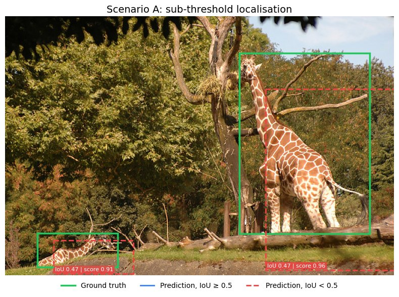
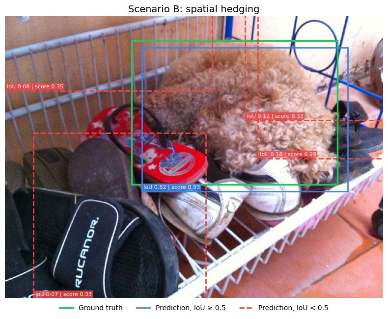

# Understanding mAP: Exposing the Blind Spots of Mean Average Precision

[](https://github.com/devtazi/Understanding-mAP/actions/workflows/ci.yml)
[](https://www.python.org/)
[](https://cocodataset.org/)
[](LICENSE)

A controlled study showing that Mean Average Precision (mAP), the metric behind nearly every object detection leaderboard, gives a score of **0.00** to a detector whose boxes all visibly cover their objects, and a **perfect 1.00** to a detector that surrounds every object with four spurious boxes.

The repository reproduces both failure modes on MS-COCO, compares mAP with the optimal **LRP** metric and the **TIDE** error breakdown, and includes a from-scratch mAP implementation that matches `pycocotools` exactly.

This code accompanies the paper *"On the Relevance of Mean Average Precision in Object Detection: A Controlled Experimental Study and Comparative Analysis of Alternative Metrics"* (Tazi & Glissa, L2TI, Université Sorbonne Paris Nord, 2025).

## Why this matters

mAP became the standard leaderboard metric because it summarises the whole precision-recall curve in one number, needs no confidence threshold, and averages over categories. The same design has two structural weaknesses:

- **A hard IoU threshold.** A prediction with IoU = 0.49 counts as a false positive and one with IoU = 0.51 as a true positive, although they look the same.
- **Only the ranking of scores matters.** Low-confidence false positives ranked after all true positives never lower the precision-recall curve, so a detector can add as many as it wants ("spatial hedging") at no cost.

Each weakness is isolated with a synthetic scenario, so the failure cannot be blamed on a particular model or training run.

## The experiment

Predictions are not produced by a trained detector. They are derived from MS-COCO ground-truth boxes by seeded perturbation functions ([`scenarios.py`](src/mapstudy/scenarios.py)), so every result can be traced to a known prediction pattern and reproduced exactly.

| Scenario A: sub-threshold localisation | Scenario B: spatial hedging |
|---|---|
|  |  |
| Every box is shifted by 20% of its width and height. The IoU is **exactly 0.471** for every object, whatever its size (`r² / (2 − r²)` with `r = 0.8`). Scores are drawn from U(0.85, 0.99). | Each object gets one accurate box (5% shift, IoU ≈ 0.82, score in U(0.85, 0.95)) and four boxes displaced by 30–70% and rescaled by 0.8–1.2 (IoU ≤ 0.497 by construction, score in U(0.10, 0.40)). |

A **baseline** detector with random jitter and uninformative scores is included for reference.

## Results

First 1,000 annotated images of COCO 2017 train (7,538 objects), seed 42. Reproduce with `mapstudy run --all`.

| Metric | Baseline | Scenario A | Scenario B |
| --- | ---: | ---: | ---: |
| mAP@[.50:.95] (pycocotools) | 0.166 | 0.000 | 0.700 |
| mAP@.50 (pycocotools) | 0.638 | 0.001 | 1.000 |
| mAP@.50 (ours, COCO 101-point) | 0.638 | 0.001 | 1.000 |
| mAP@.50 (ours, VOC all-point) | 0.639 | 0.001 | 1.000 |
| mAP@.50 (ours, no interpolation) | 0.611 | 0.001 | 1.000 |
| oLRP ↓ | 0.814 | 0.999 | 0.355 |
| oLRP localisation ↓ | 0.354 | 0.398 | 0.178 |
| oLRP false positive ↓ | 0.224 | 0.903 | 0.000 |
| oLRP false negative ↓ | 0.233 | 0.990 | 0.000 |
| TIDE AP@.50 | 0.638 | 0.001 | 1.000 |
| TIDE dominant error | Loc | Loc | none |
| Detections / objects | 7538 / 7538 | 7538 / 7538 | 37690 / 7538 |

The full reports, with every TIDE error type, are in [`results/`](results/).

### What the numbers show

**Scenario A: mAP gives the harshest possible verdict.** Every box visibly covers its object, yet mAP is essentially zero. The few true positives (mAP@.50 = 0.001) are predictions that happen to overlap *another* object of the same class by more than 0.5. mAP only says that the detector fails. TIDE says why: fixing localisation errors (`Loc`) would recover 98.6 of the 99.9 AP points lost.

**Scenario B: mAP rewards hedging.** All four spurious boxes score below every accurate box, so they only appear in the ranking once recall has already reached 1. The precision-recall curve is never lowered and mAP@.50 is perfect. Interpolation plays no role here: the uninterpolated AP is also 1.000. TIDE finds **no error to fix** for the same reason: it measures errors by the AP gained after fixing them, and there is none to gain. Only oLRP, which picks the optimal confidence threshold, reports the residual localisation error (0.178) and, implicitly, a threshold that discards all 30,152 spurious boxes.

mAP@[.50:.95] = 0.700 in scenario B is not a coincidence. With IoU ≈ 0.82, the accurate boxes are true positives for the 7 thresholds from 0.50 to 0.80 and false positives for the 3 above.

**Interpolation.** On the baseline, removing the monotone envelope lowers mAP@.50 from 0.638 to 0.611. The "no interpolation" row is not a standard metric; it shows how much the smoothing hides.

## Metrics

| Metric | Implementation | What it adds |
|---|---|---|
| **mAP@.50, mAP@[.50:.95]** | [`pycocotools`](https://github.com/cocodataset/cocoapi) and [`average_precision.py`](src/mapstudy/average_precision.py) | Standard leaderboard metric. The from-scratch version exposes the interpolation scheme and is tested to match `pycocotools` to 1e-9. |
| **oLRP** and its components | [`third_party/cocoeval_lrp.py`](src/mapstudy/third_party/cocoeval_lrp.py) ([Oksuz et al., 2018](https://arxiv.org/abs/1807.01696)) | Separates localisation, false-positive and false-negative error at the optimal confidence threshold. |
| **TIDE** | [`tidecv`](https://github.com/dbolya/tide) ([Bolya et al., 2020](https://dbolya.github.io/tide/)) | Attributes lost AP to `Cls`, `Loc`, `Both`, `Dupe`, `Bkg` and `Miss` errors. |

```
LRP(τ) = [ Σ_TP (1 − IoU) / (1 − 0.5) + FP(τ) + FN(τ) ] / [ TP(τ) + FP(τ) + FN(τ) ]
oLRP   = min_τ LRP(τ)
```

## Getting started

```bash
git clone https://github.com/devtazi/Understanding-mAP.git
cd Understanding-mAP
python -m venv .venv && source .venv/bin/activate
pip install -e ".[dev]"
```

COCO 2017 annotations are read from the [`HichTala/coco`](https://huggingface.co/datasets/HichTala/coco) Parquet export on the Hugging Face Hub. Only the Parquet shards that are needed are downloaded and cached locally: the first one (about 475 MB) covers roughly 3,000 images.

```bash
mapstudy run --all                         # every scenario, 1,000 images, writes results/
mapstudy run --scenario a b --n-images 200 --seed 0
mapstudy visualize --scenario b --image-index 5
pytest                                     # offline, no dataset download
```

[`notebooks/walkthrough.ipynb`](notebooks/walkthrough.ipynb) walks through the scenarios, builds a precision-recall curve step by step and compares the metrics.

## Repository layout

```
src/mapstudy/
├── boxes.py               IoU and box geometry
├── data.py                Data structures and COCO loading
├── scenarios.py           Synthetic detectors (baseline, A, B)
├── average_precision.py   From-scratch AP / mAP with COCO matching and selectable interpolation
├── evaluation.py          pycocotools, custom mAP, oLRP and TIDE on the same predictions
├── reporting.py           Results table
├── visualization.py       Figures
├── cli.py                 `mapstudy` command
└── third_party/           Vendored COCO evaluator extended with LRP
tests/                     Unit tests, including a cross-check against pycocotools
notebooks/                 Walkthrough notebook
results/                   Reference outputs of `mapstudy run --all`
docs/figures/              Figures used in this README
```

## Limitations

- The synthetic detectors produce clean, isolated failure modes. Real detectors mix several error types.
- The first images of the train split are used rather than a random sample, which can bias the category distribution.
- mAP, oLRP and TIDE all rely on the same one-to-one matching between predictions and ground truths. In crowded scenes, the matching itself can dominate the result, as the few true positives of scenario A show.
- Everything is evaluated at the bounding-box level only.

## References

1. Bolya, D., Foley, S., Hays, J., & Hoffman, J. (2020). [TIDE: A General Toolbox for Identifying Object Detection Errors](https://dbolya.github.io/tide/). ECCV.
2. Everingham, M., Van Gool, L., Williams, C. K. I., Winn, J., & Zisserman, A. (2010). The Pascal Visual Object Classes (VOC) Challenge. *IJCV*, 88(2), 303-338.
3. Kirillov, A., He, K., Girshick, R., Rother, C., & Dollár, P. (2019). Panoptic Segmentation. CVPR.
4. Lin, T.-Y., Maire, M., Belongie, S., Hays, J., Perona, P., Ramanan, D., Dollár, P., & Zitnick, C. L. (2014). [Microsoft COCO: Common Objects in Context](https://arxiv.org/abs/1405.0312). ECCV.
5. Oksuz, K., Cam, B. C., Akbas, E., & Kalkan, S. (2018). [Localization Recall Precision (LRP): A New Performance Metric for Object Detection](https://arxiv.org/abs/1807.01696). ECCV.
6. Oksuz, K., Cam, B. C., Kalkan, S., & Akbas, E. (2021). Imbalance Problems in Object Detection: A Review. *IEEE TPAMI*, 43(10), 3388-3415.
7. Padilla, R., Passos, W. L., Dias, T. L. B., Netto, S. L., & da Silva, E. A. B. (2021). A Comparative Analysis of Object Detection Metrics with a Companion Open-Source Toolkit. *Electronics*, 10(3), 279.
8. Rezatofighi, H., Tsoi, N., Gwak, J., Sadeghian, A., Reid, I., & Savarese, S. (2019). [Generalized Intersection over Union](https://arxiv.org/abs/1902.09630). CVPR.
9. Wolf, T., et al. (2020). Transformers: State-of-the-Art Natural Language Processing. EMNLP System Demonstrations.

## Authors

Adam Tazi and Mohamed Glissa, Université Sorbonne Paris Nord, L2TI laboratory (SyCoIA team).
Supervised by Hajer Fradi and Hicham Talaoubrid.
