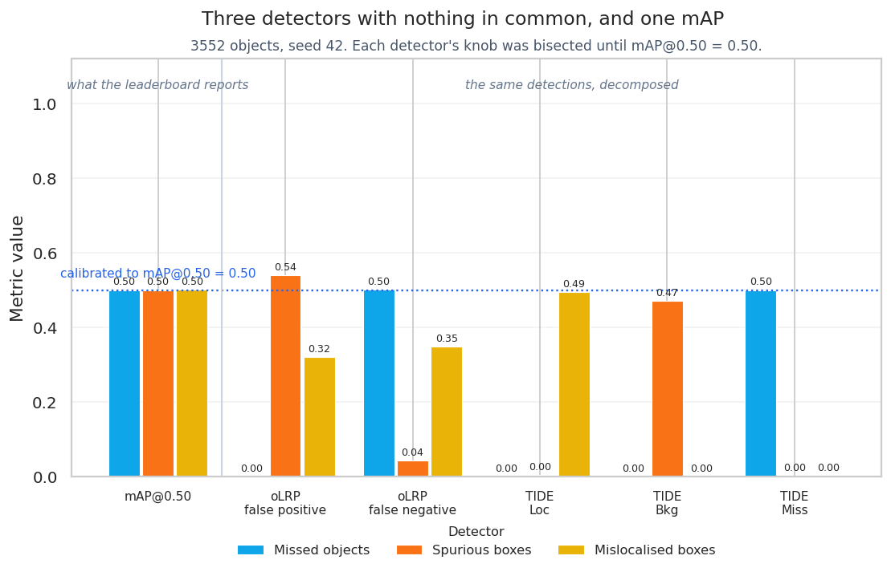
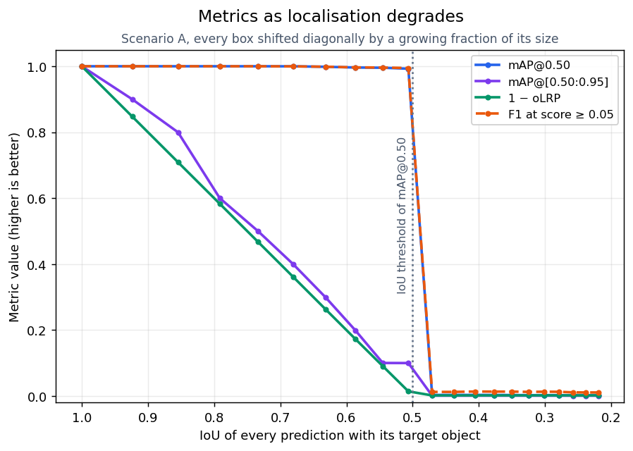
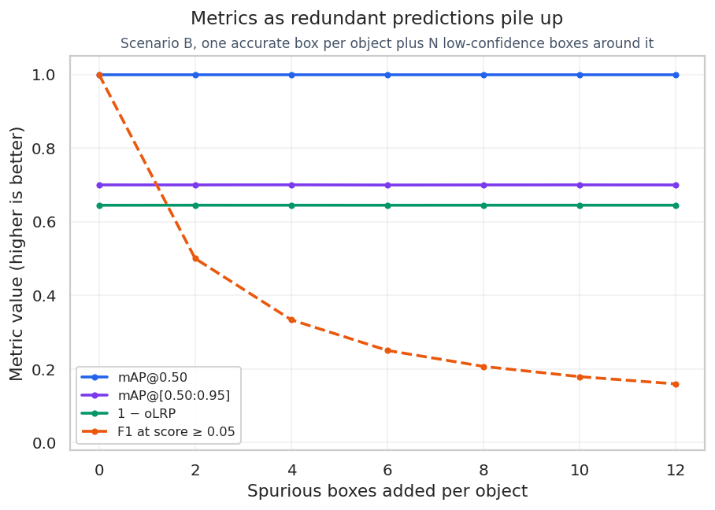
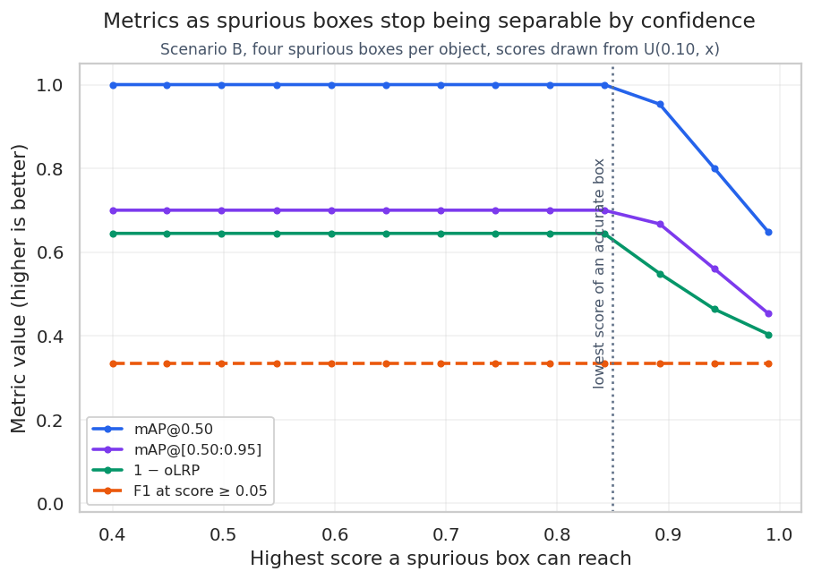
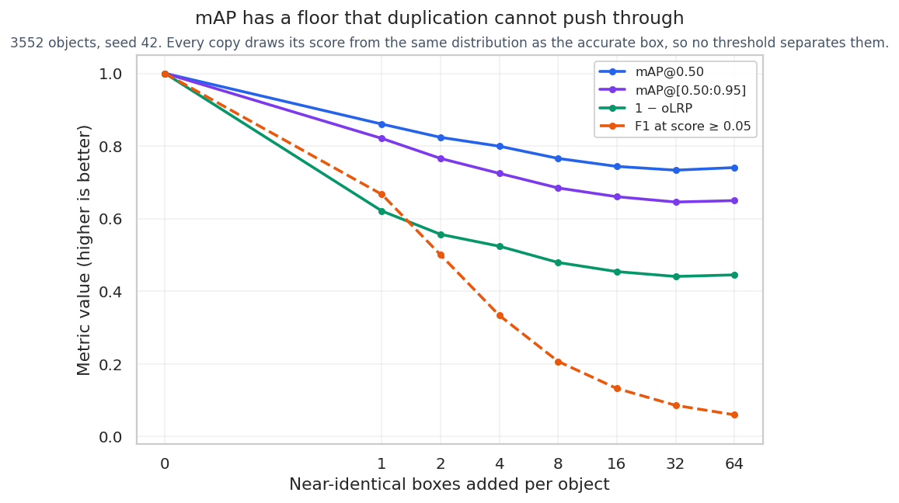
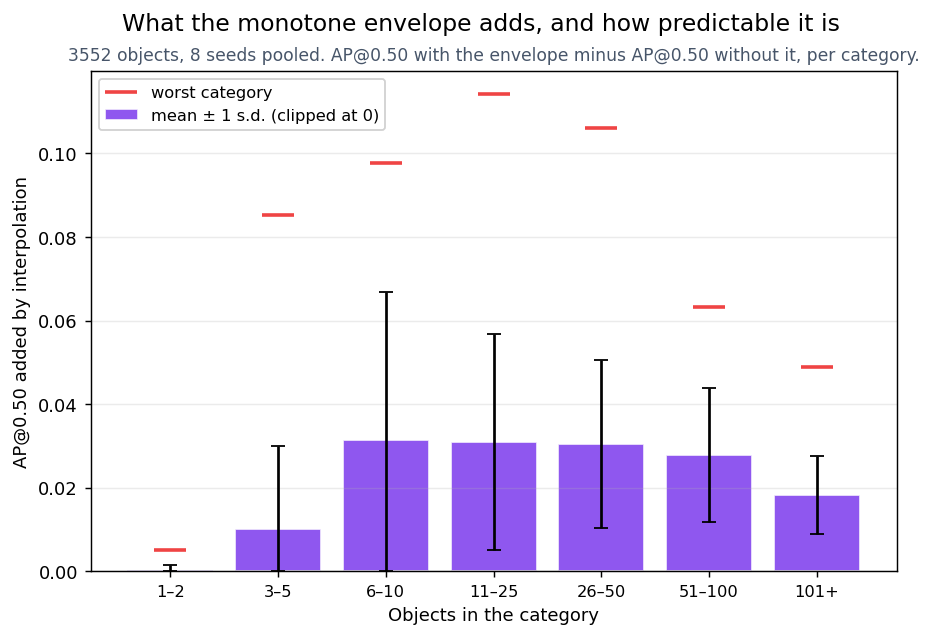
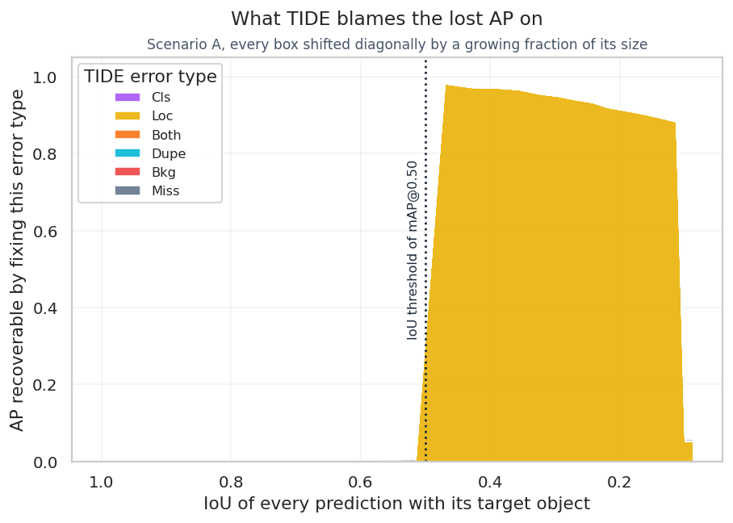

# Understanding mAP: What the Leaderboard Number Cannot See

[](https://github.com/devtazi/Understanding-mAP/actions/workflows/ci.yml)
[](https://www.python.org/)
[](https://cocodataset.org/)
[](LICENSE)

A controlled study of mean Average Precision, the metric behind nearly every object
detection leaderboard. It does two things, in order:

1. **It shows what mAP cannot see**, with six experiments on MS-COCO in which the
   detector is known exactly by construction, so no result can be blamed on a model.
2. **It shows that oLRP and TIDE see it**, on the same detections, and says precisely
   which part of each metric does the work — and where they fail too.

The headline result is the one mAP's defenders cannot answer. Three detectors are built
to fail in three mutually exclusive ways, then calibrated until they share the same
score. One reports 1,837 boxes and every one of them is exact. Another reports 8,533
boxes of which 58% are spurious. The third reports 3,552 boxes and misplaces 35% of
them. **All three score mAP@0.50 = 0.500.** oLRP's components and TIDE's breakdown tell
them apart immediately.

This code accompanies the paper *"On the Relevance of Mean Average Precision in Object
Detection: A Controlled Experimental Study and Comparative Analysis of Alternative
Metrics"* (Tazi & Glissa, IMT Mines Alès & L2TI, Université Sorbonne Paris Nord, 2025).

## How a metric is judged here

Three criteria, applied to every metric in the study:

| Criterion | Question it asks |
|---|---|
| **Completeness** | Does it account for all three failures — localisation, false positives, false negatives? |
| **Interpretability** | Given the score, do you know what to fix? |
| **Practicality** | Does it survive contact with deployment: a confidence threshold, a rare category, a small validation set? |

mAP is examined against each in turn, then oLRP and TIDE are put through the same three.

## The experiment

Predictions are not produced by a trained detector. They are derived from MS-COCO
ground-truth boxes by seeded perturbation functions ([`scenarios.py`](src/mapstudy/scenarios.py)),
so every result traces back to a known prediction pattern and reproduces exactly. Where
a detector needs a knob set to a particular value, the knob is *solved for* by bisection
rather than chosen by hand ([`equivalence.py`](src/mapstudy/equivalence.py)).

Unless stated otherwise: first 500 annotated images of COCO 2017 train, 3,552 objects,
seed 42.

---

# Part 1 — What mAP cannot see

## 1. Completeness: one score, three detectors



Three detectors are constructed, each committing exactly one kind of error and no other.
Every box meant to be correct is the ground-truth box itself, so localisation noise
cannot contaminate the comparison. Each has one knob, and each knob is bisected until
mAP@0.50 lands on 0.500.

| | Missed objects | Spurious boxes | Mislocalised boxes |
|---|---:|---:|---:|
| What it does | reports 51.7% of objects, every box exact | reports every object, plus 1.40 spurious boxes each | reports every object, 35.4% of boxes below IoU 0.5 |
| Knob solved for | `detect_rate` = 0.4990 | `ghost_rate` = 1.4023 | `error_rate` = 0.3457 |
| Detections emitted | 1,837 | 8,533 | 3,552 |
| Precision at score ≥ 0.05 | **1.000** | **0.416** | **0.646** |
| Recall at score ≥ 0.05 | **0.517** | **1.000** | **0.646** |
| **mAP@0.50** | **0.4999** | **0.4999** | **0.5003** |
| **mAP@[.50:.95]** | **0.4999** | **0.4998** | **0.4972** |

A detector with perfect precision, a detector with perfect recall, and a detector with
neither. mAP@0.50 separates them by **0.0004** and mAP@[.50:.95] by **0.0026**. Averaging
over ten IoU thresholds does not help, because the thing being averaged is the same
thing ten times.

This is not a claim that mAP is sometimes misleading. It is the statement that mAP is
**not injective**: the map from detector behaviour to score cannot be inverted, and a
leaderboard position is therefore compatible with any of these three detectors. Which one
you shipped is not recoverable from the number.

Reproduce with `mapstudy equivalence`. The reference illustration of this problem is
Fig. 1 of [Oksuz et al. (2018)](https://arxiv.org/abs/1807.01696); what is added here is
that the equality is *solved for* rather than drawn, on real data, with the error
profiles known exactly.

## 2. Completeness: the IoU threshold is a cliff, not a slope



Every box is shifted diagonally by a growing fraction of its size, so the IoU of *every*
prediction is known in closed form (`r²/(2−r²)` with `r = 1 − shift`) and falls from 1.0
to 0.09.

| IoU of every prediction | 0.68 | 0.57 | 0.52 | **0.47** | 0.43 |
|---|---:|---:|---:|---:|---:|
| mAP@0.50 | 1.000 | 0.996 | 0.994 | **0.003** | 0.003 |
| oLRP ↓ | 0.639 | 0.869 | 0.968 | **0.999** | 0.999 |

Localisation quality drops by a third while mAP@0.50 moves by 0.006, then collapses to
zero between two adjacent points. On either side of the threshold mAP@0.50 carries **no
information at all** about localisation: it reports which side of 0.5 the boxes are on,
and nothing else. mAP@[.50:.95] degrades in ten visible steps, one per threshold crossed
— a staircase, not a curve.

The shift that puts IoU exactly at 0.5 is `1 − sqrt(2/3) ≈ 0.1835`. A detector at
`shift = 0.1834` scores ~1.0 and a detector at `shift = 0.1836` scores ~0.0, and no
human looking at the two sets of boxes could tell them apart.

## 3. Completeness: spatial hedging is free



Each object gets one accurate box at a high score plus a growing number of displaced
boxes at low scores — a detector that covers its bets.

| Spurious boxes per object | 0 | 4 | 8 | 12 |
|---|---:|---:|---:|---:|
| mAP@0.50 | 1.000 | 1.000 | 1.000 | 1.000 |
| mAP@[.50:.95] | 0.700 | 0.700 | 0.700 | 0.700 |
| oLRP ↓ | 0.355 | 0.355 | 0.355 | 0.355 |
| F1 at score ≥ 0.05 | 1.000 | 0.333 | 0.207 | 0.159 |

Not one ranking-based metric reacts, to three decimal places, while the detector emits
thirteen times more boxes. The spurious boxes all rank below every accurate box, so they
enter the precision-recall curve only after recall has reached 1 and the curve is never
lowered.

**This blindness is not specific to mAP.** oLRP is equally still, and so is TIDE, because
all three evaluate a *ranking* and are free to choose where to cut it. Only a metric
evaluated at a fixed operating point reacts: F1 falls from 1.000 to 0.159.

### When hedging becomes visible



Keeping four spurious boxes per object and raising the top of their score range towards
the accurate boxes' 0.85–0.95:

| Highest score of a spurious box | 0.40 | 0.84 | **0.89** | 0.94 | 0.99 |
|---|---:|---:|---:|---:|---:|
| mAP@0.50 | 1.000 | 1.000 | **0.953** | 0.801 | 0.647 |
| oLRP ↓ | 0.355 | 0.355 | **0.451** | 0.536 | 0.597 |
| oLRP localisation ↓ | 0.178 | 0.178 | 0.178 | 0.178 | 0.178 |

Nothing moves until the two score populations overlap, then every ranking metric degrades
at once. **What these metrics measure is not whether a detector emits redundant boxes,
but whether its confidence scores are well enough calibrated to separate them.**

## 4. Completeness: mAP has a floor duplication cannot push through



The previous experiment has an escape hatch: a reader can object that the detector is
merely uncalibrated, and that a confidence threshold would remove the redundant boxes.
This one closes it. Every object is covered by near-identical copies whose scores are
drawn from **the same distribution as the accurate box**, so no threshold separates them.

| Copies added per object | 0 | 1 | 4 | 16 | 64 |
|---|---:|---:|---:|---:|---:|
| Detections for 3,552 objects | 3,552 | 7,104 | 17,760 | 60,384 | **230,880** |
| Precision at score ≥ 0.05 | 1.000 | 0.500 | 0.200 | 0.071 | **0.031** |
| **mAP@0.50** | 1.000 | 0.860 | 0.799 | 0.744 | **0.740** |
| F1 at score ≥ 0.05 | 1.000 | 0.667 | 0.333 | 0.132 | **0.060** |

**65 boxes per object — 230,880 detections for 3,552 objects, 97% of them wrong — and
mAP@0.50 still reports 0.740.** The curve flattens after the first few copies and stops
falling.

The reason is structural, and it is worth stating precisely because it is not the
ranking argument of the previous section. The matcher awards the true positive to the
*highest-scoring* box covering the object. With `k` copies, the true positive is
therefore the maximum of `k+1` draws, which rises in the ranking exactly as fast as the
false positives accumulate below it. The redundant boxes select themselves out of the
part of the curve that mAP integrates. **A detector cannot be made to fail by
duplication alone**, whatever the confidence of the duplicates.

Reproduce with `mapstudy duplication`.

## 5. Practicality: AP reads the ranking, never the scores

A detector's confidence scores are replaced by strictly increasing functions of
themselves. The boxes, the labels and the order of the detections are untouched; only the
numbers change.

| Score transform | Resulting score range | mAP@0.50 | mAP@[.50:.95] | F1 at score ≥ 0.05 |
|---|---|---:|---:|---:|
| identity | [0.100, 1.000] | 0.643157 | 0.177631 | 0.772 |
| `s³` | [0.001, 0.999] | 0.643157 | 0.177631 | 0.642 |
| `√s` | [0.316, 1.000] | 0.643157 | 0.177631 | 0.772 |
| logistic | [0.008, 0.998] | 0.643157 | 0.177631 | 0.696 |
| **`0.10 + 0.02·s`** | **[0.102, 0.120]** | **0.643157** | **0.177631** | 0.772 |

The deviation across every row is **exactly 0.000000** — not approximately, identically,
and the test suite asserts it. The last row is the one that matters: every detection now
scores between 0.102 and 0.120, so the detector is unusable at any conventional
threshold, and mAP has not moved by one unit in the last decimal place.

This is the formal version of "mAP cannot help you choose a confidence threshold". The
information required to choose one is not merely hard to extract from mAP — it is
provably absent, because mAP is invariant to every transformation that could change the
answer.

## 6. Practicality: interpolation is a silent, uneven gift



Before integrating, COCO replaces each precision by the highest precision reached at any
greater recall. This monotone envelope can only raise AP. The question is by how much,
and whether that amount is a fixed offset.

Measured per category, pooled over 8 seeds:

| Objects in the category | 1–2 | 3–5 | 6–10 | 11–25 | 26–50 | 51–100 | 101+ |
|---|---:|---:|---:|---:|---:|---:|---:|
| Mean AP added | +0.000 | +0.010 | +0.031 | +0.031 | +0.031 | +0.028 | +0.018 |
| Standard deviation | 0.001 | 0.020 | **0.035** | 0.026 | 0.020 | 0.016 | **0.009** |
| Worst single category | +0.005 | +0.085 | +0.098 | **+0.114** | +0.106 | +0.063 | +0.049 |

The mean is roughly flat at about 3 AP points from 6 objects upwards. What changes with
category size is not the size of the correction but its **predictability**: the standard
deviation is four times larger for categories of 6–10 objects than for categories past
100, and an individual small category can be handed **11 AP points** by interpolation
alone. Since mAP weights every category equally, those swings pass straight into the
leaderboard number.

Two honest qualifications. The effect is *not* monotone in category size — below three
objects the curve has too few steps to have dips worth filling, and the bias vanishes.
And "AP without interpolation" is not a standard metric; it is shown to measure what the
smoothing hides, not to propose an alternative.

---

# Part 2 — What oLRP and TIDE see instead

Every number in this part comes from the **same detections** as Part 1. The question is
never whether a metric is higher or lower, but whether it separates what mAP merges, and
whether what it reports is actionable.

## 7. The decomposition is what does the work — not the score

Return to the three detectors of experiment 1, all at mAP@0.50 = 0.500. Spread means
`max − min` across the three: a metric that cannot tell them apart has a spread of zero.

| | Missed objects | Spurious boxes | Mislocalised boxes | **Spread** |
|---|---:|---:|---:|---:|
| mAP@0.50 | 0.4999 | 0.4999 | 0.5003 | **0.0004** |
| mAP@[.50:.95] | 0.4999 | 0.4998 | 0.4972 | **0.0026** |
| oLRP ↓ | 0.501 | 0.558 | 0.492 | **0.066** |
| oLRP localisation ↓ | 0.000 | 0.000 | 0.002 | 0.002 |
| **oLRP false positive** ↓ | 0.000 | 0.540 | 0.320 | **0.540** |
| **oLRP false negative** ↓ | 0.501 | 0.042 | 0.348 | **0.459** |
| **TIDE Loc** | 0.000 | 0.004 | 0.495 | **0.495** |
| **TIDE Bkg** | 0.000 | 0.470 | 0.000 | **0.470** |
| **TIDE Miss** | 0.500 | 0.000 | 0.000 | **0.498** |
| TIDE verdict | `Miss` | `Bkg` | `Loc` | — |

Read the `oLRP ↓` row before the ones below it. **The oLRP score is itself a poor
discriminator here: 0.066 of spread, against 0.0004 for mAP.** Better by two orders of
magnitude, but still three detectors within 0.07 of each other — closer than the gap
between consecutive entries on most leaderboards. Anyone comparing these three on the
oLRP number alone would learn almost nothing.

What separates them is the **decomposition**: false positive and false negative spread by
0.54 and 0.46, and TIDE names each detector's failure on the first try. The case for oLRP
over mAP is therefore not "oLRP is a better number". It is that oLRP *is not one number*,
and the three it reports are not redundant.

This is the precise, defensible version of the claim, and it is narrower than the one
usually made. A leaderboard that prints oLRP as a single column throws away the part that
matters and buys very little over mAP.

### Where oLRP stops and TIDE starts

The `oLRP localisation` row is nearly flat at zero — including for the detector whose
*only* error is mislocalisation. This is not a bug. oLRP's localisation term measures the
tightness of boxes that already passed the IoU threshold; a box that *misses* the
threshold is not a loose true positive, it is a false positive, and the object it failed
to cover is a false negative. So oLRP reports mislocalisation as **0.320 FP + 0.348 FN**,
which is exactly what it reports for a detector that emits a spurious box and separately
misses an object. Those are different diseases with the same symptoms.

TIDE resolves it: `Loc = 0.495`, every other error type at zero. It can, because it asks
a different question — how much AP would come back if this one error type were fixed —
and fixing localisation recovers what fixing anything else would not.

**oLRP and TIDE are not two candidates for the same job.** oLRP splits the error into
three commensurable components at a usable operating point; TIDE attributes lost AP to
six named causes. The experiment above needs both, and neither alone is sufficient.

## 8. oLRP reacts continuously where mAP falls off a cliff

From experiment 2, the same sweep, the full picture:

| shift | 0.000 | 0.050 | 0.100 | 0.150 | 0.175 | **0.200** | 0.300 | 0.600 |
|---|---:|---:|---:|---:|---:|---:|---:|---:|
| True IoU of every box | 1.000 | 0.822 | 0.681 | 0.566 | 0.516 | **0.471** | 0.325 | 0.087 |
| mAP@0.50 | 1.000 | 1.000 | 1.000 | 0.996 | 0.994 | **0.003** | 0.002 | 0.001 |
| oLRP ↓ | 0.000 | 0.355 | 0.639 | 0.869 | 0.968 | **0.999** | 0.998 | 0.999 |

Over `shift ∈ [0, 0.175]`, localisation quality halves, mAP@0.50 moves by 0.006 and oLRP
traverses 0.00 → 0.97 monotonically. On this range oLRP is not marginally better than
mAP; it is the difference between a metric that measures localisation and one that does
not.

**But look at the right half of the table.** Past the threshold, oLRP saturates at 0.999
while the true IoU keeps falling from 0.471 to 0.087. oLRP is continuous *above* the IoU
threshold and blind *below* it, because its localisation term is normalised by `1 − 0.5`
and counts only matched true positives. Its advantage is real and it is bounded: oLRP
grades a detector that is nearly good enough, and says nothing useful about one that is
far off.

### What TIDE adds: not how much was lost, but why



At `shift = 0.20`, mAP reports 0.003 and stops. TIDE reports that **98.3% of the lost AP
returns by fixing localisation alone**, every other error type at zero. That is the
difference between a score and a diagnosis, and it is the answer to "the model scores
0.003, now what?".

On scenario A of the reference table — every box shifted by 20%, mAP@0.50 = 0.001 —
TIDE attributes **0.986 of the 0.999 lost AP to `Loc`**.

The figure also shows a limit of TIDE. Below IoU = 0.1, its background threshold, a
prediction stops being a mislocalised box and becomes a spurious one: attribution to
`Loc` collapses from 0.90 to 0.05 and **nothing takes its place**. TIDE measures the AP
recovered by fixing *one* error type at a time, and there the detector is wrong in two
ways at once, so no single fix recovers anything. About 0.94 of lost AP is then
attributed to nothing at all.

## 9. oLRP sees the duplication that mAP floors on

Experiment 4, with oLRP added:

| Copies added per object | 0 | 1 | 4 | 16 | 64 |
|---|---:|---:|---:|---:|---:|
| Detections | 3,552 | 7,104 | 17,760 | 60,384 | 230,880 |
| mAP@0.50 | 1.000 | 0.860 | 0.799 | 0.744 | **0.740** |
| **oLRP ↓** | 0.000 | 0.379 | 0.476 | 0.546 | **0.555** |
| oLRP false positive ↓ | 0.000 | 0.245 | 0.285 | 0.305 | 0.301 |
| **oLRP optimal threshold τ\*** | 0.211 | 0.471 | 0.763 | 0.925 | **0.981** |
| F1 at score ≥ 0.05 | 1.000 | 0.667 | 0.333 | 0.132 | 0.060 |

This is the clearest single-metric win in the study. mAP degrades by 0.26 and stops;
oLRP degrades by 0.56 and keeps moving. The reason oLRP works here and failed in
experiment 3 is exact: in experiment 3 the redundant boxes scored below everything, so
oLRP's minimisation over thresholds discarded them for free. Here they score as high as
the accurate boxes, no threshold can discard them, and oLRP is forced to count them.

**And τ\* carries the practical answer.** As duplication grows, the threshold minimising
LRP climbs from 0.211 to 0.981: oLRP is saying *this detector is only usable if you keep
detections above 0.98*. mAP has no equivalent output. τ\* is reported by
[`evaluate_lrp`](src/mapstudy/evaluation.py) and is the part of oLRP that leaderboards
discard.

## 10. oLRP is rank-invariant too — but τ\* is not

Experiment 5, with oLRP added. This is the place where oLRP's advantage is smallest and
it is stated plainly:

| Score transform | Score range | mAP@0.50 | oLRP ↓ | **τ\*** | F1 at ≥ 0.05 |
|---|---|---:|---:|---:|---:|
| identity | [0.100, 1.000] | 0.643157 | 0.8108 | **0.288** | 0.772 |
| `s³` | [0.001, 0.999] | 0.643157 | 0.8108 | **0.074** | 0.642 |
| `√s` | [0.316, 1.000] | 0.643157 | 0.8108 | **0.507** | 0.772 |
| logistic | [0.008, 0.998] | 0.643157 | 0.8108 | **0.191** | 0.696 |
| `0.10 + 0.02·s` | [0.102, 0.120] | 0.643157 | 0.8108 | **0.106** | 0.772 |

**The oLRP score is invariant too**, to four decimal places, for the same reason as mAP:
it is a minimum over thresholds, and a monotone remapping moves the thresholds with the
scores. Any claim that oLRP "takes confidence into account" where mAP does not is false
as stated, and this table is the refutation.

What survives is narrower and true: oLRP *reports* τ\*, and τ\* tracks the actual score
values, moving from 0.074 to 0.507 across the rows. The score is rank-invariant; the
recommendation attached to it is not. mAP emits no such recommendation at all.

## 11. The three criteria, settled

| | | mAP | oLRP | TIDE |
|---|---|---|---|---|
| **Completeness** | Localisation | Binary at the IoU threshold: a cliff (exp. 2) | Continuous above the threshold, saturated below (exp. 8) | Attributes lost AP to `Loc` on both sides (exp. 8) |
| | FP vs FN | Merged into one curve; indistinguishable (exp. 1) | Separated: spreads 0.54 and 0.46 (exp. 7) | Separated, and by *kind* of FP: `Bkg`, `Dupe`, `Cls` (exp. 7) |
| | Redundant boxes | Floor at 0.740 under 65× duplication (exp. 4) | Reacts: 0.000 → 0.555 (exp. 9) | `Dupe` rises to 0.24 (exp. 9) |
| | Low-score hedging | Blind (exp. 3) | **Equally blind** (exp. 3) | **Equally blind** (exp. 3) |
| **Interpretability** | Given the score, what do you fix? | Nothing: three detectors, one score (exp. 1) | Which of three error terms dominates (exp. 7) | Which of six named causes, ranked by AP recoverable (exp. 7) |
| | As a single number | — | Nearly as uninformative as mAP: spread 0.066 (exp. 7) | Not a single number by construction |
| **Practicality** | Choosing a threshold | Provably impossible: invariant (exp. 5) | Score invariant too, but reports τ\* (exp. 10) | — |
| | Rare categories | Interpolation adds up to +0.11 AP, unpredictably (exp. 6) | No interpolation | No interpolation |

## Conclusion

Two claims are supported by the experiments above, and a third is not.

**Supported.** mAP is not injective: detectors with opposite failures, opposite precision
and opposite recall reach the same score, and no amount of averaging over IoU thresholds
changes that. And mAP is invariant to every monotone transformation of confidence, so it
provably cannot inform the one decision every deployment requires.

**Supported.** oLRP's three components and TIDE's six error types recover what mAP merges,
on the same detections, and τ\* answers a question mAP cannot express. Reporting oLRP
alongside TIDE is a strict improvement over reporting mAP.

**Not supported, and asserted here only in this restricted form.** "oLRP is a better
number than mAP" does not survive the evidence. As a scalar, oLRP separates the three
calibrated detectors by 0.066, is blind to low-score hedging exactly as mAP is, is
invariant to score remapping exactly as mAP is, and saturates below the IoU threshold.
What is better is not the number but the **decomposition**, and it is better because it
is more than one number.

The practical recommendation follows from the failures shared by all three: report
oLRP's components with τ\* and a TIDE breakdown, and add one metric at a fixed operating
point — the F1 column is the only one in this study that reacted to every failure mode
tested.

---

# Reference results

The two original scenarios, on the first 1,000 annotated images of COCO 2017 train
(7,538 objects), seed 42. Reproduce with `mapstudy run --all`.

| Scenario A: sub-threshold localisation | Scenario B: spatial hedging |
|---|---|
|  |  |
| Every box shifted by 20% of its size. IoU is **exactly 0.471** for every object, whatever its size. Scores in U(0.85, 0.99). | One accurate box per object (IoU ≈ 0.82, score in U(0.85, 0.95)) plus four boxes displaced by 30–70% and rescaled by 0.8–1.2 (IoU ≤ 0.497 by construction, score in U(0.10, 0.40)). |

| Metric | Baseline | Scenario A | Scenario B |
| --- | ---: | ---: | ---: |
| mAP@[.50:.95] (pycocotools) | 0.166 | 0.000 | 0.700 |
| mAP@.50 (pycocotools) | 0.638 | 0.001 | 1.000 |
| mAP@.50 (ours, COCO 101-point) | 0.638 | 0.001 | 1.000 |
| mAP@.50 (ours, VOC all-point) | 0.639 | 0.001 | 1.000 |
| mAP@.50 (ours, no interpolation) | 0.611 | 0.001 | 1.000 |
| oLRP ↓ | 0.814 | 0.999 | 0.355 |
| oLRP localisation ↓ | 0.354 | 0.398 | 0.178 |
| oLRP false positive ↓ | 0.224 | 0.903 | 0.000 |
| oLRP false negative ↓ | 0.233 | 0.990 | 0.000 |
| TIDE AP@.50 | 0.638 | 0.001 | 1.000 |
| TIDE dominant error | Loc | Loc | none |
| Detections / objects | 7538 / 7538 | 7538 / 7538 | 37690 / 7538 |

**Scenario A: the harshest possible verdict.** Every box visibly covers its object, yet
mAP is essentially zero. The few true positives are predictions that happen to overlap
*another* object of the same class by more than 0.5. TIDE says why: fixing localisation
recovers 98.6 of the 99.9 AP points lost.

**Scenario B: a perfect score for a bad detector.** All four spurious boxes rank below
every accurate box, so the precision-recall curve is never lowered. Interpolation plays
no role: the uninterpolated AP is also 1.000. TIDE finds **no error to fix**, because it
measures AP recoverable and there is none to recover. oLRP reports 0.355, but only from
the residual localisation error of the accurate boxes — its false-positive term is
**0.000**, so it does not see the spurious boxes either. mAP@[.50:.95] = 0.700 is not a
coincidence: with IoU ≈ 0.82 the accurate boxes are true positives at 7 of the 10
thresholds.

# Metrics

| Metric | Implementation | What it adds |
|---|---|---|
| **mAP@.50, mAP@[.50:.95]** | [`pycocotools`](https://github.com/cocodataset/cocoapi) and [`average_precision.py`](src/mapstudy/average_precision.py) | Standard leaderboard metric. The from-scratch version exposes the interpolation scheme and is tested to match `pycocotools` to 1e-9. |
| **oLRP**, its components and **τ\*** | [`third_party/cocoeval_lrp.py`](src/mapstudy/third_party/cocoeval_lrp.py) ([Oksuz et al., 2018](https://arxiv.org/abs/1807.01696)) | Separates localisation, false-positive and false-negative error at the optimal confidence threshold, and reports that threshold. |
| **TIDE** | [`tidecv`](https://github.com/dbolya/tide) ([Bolya et al., 2020](https://dbolya.github.io/tide/)) | Attributes lost AP to `Cls`, `Loc`, `Both`, `Dupe`, `Bkg` and `Miss`. |
| **Precision, recall, F1 at a fixed threshold** | [`average_precision.py`](src/mapstudy/average_precision.py) | Evaluates the detector at one operating point, as deployed. The only metric here that reacted to every failure mode tested. |

```
LRP(τ) = [ Σ_TP (1 − IoU) / (1 − 0.5) + FP(τ) + FN(τ) ] / [ TP(τ) + FP(τ) + FN(τ) ]
oLRP   = min_τ LRP(τ)        τ* = argmin_τ LRP(τ)
```

# Getting started

```bash
git clone https://github.com/devtazi/Understanding-mAP.git
cd Understanding-mAP
python -m venv .venv && source .venv/bin/activate
pip install -e ".[dev]"
```

COCO 2017 annotations are read from the [`HichTala/coco`](https://huggingface.co/datasets/HichTala/coco)
Parquet export on the Hugging Face Hub. Only the shards that are needed are downloaded
and cached: the first one (about 475 MB) covers roughly 3,000 images.

```bash
mapstudy run --all                # every scenario, 1,000 images, writes results/

# Part 1 — the blind spots
mapstudy equivalence              # exp. 1 and 7: three detectors, one mAP
mapstudy sweep shift              # exp. 2 and 8: the IoU cliff, plus the TIDE breakdown
mapstudy sweep hedges             # exp. 3: redundant boxes at low confidence
mapstudy sweep hedge-score        # exp. 3: when hedging becomes visible
mapstudy duplication              # exp. 4 and 9: the floor duplication cannot break
mapstudy invariance               # exp. 5 and 6: score invariance, interpolation bias

mapstudy visualize --scenario b --image-index 5
pytest                            # offline, no dataset download
```

[`notebooks/walkthrough.ipynb`](notebooks/walkthrough.ipynb) walks through the scenarios,
builds a precision-recall curve step by step and compares the metrics.

# Repository layout

```
src/mapstudy/
├── boxes.py               IoU and box geometry
├── data.py                Data structures and COCO loading
├── scenarios.py           Synthetic detectors: baseline, A, B, and the equivalence family
├── average_precision.py   From-scratch AP / mAP and fixed-threshold operating points
├── evaluation.py          pycocotools, custom mAP, oLRP (with τ*) and TIDE
├── sweep.py               Parameter sweeps (experiments 2, 3, 8)
├── equivalence.py         Calibration to a common mAP, and the duplication floor (1, 4, 7, 9)
├── invariance.py          Score invariance and interpolation bias (5, 6, 10)
├── reporting.py           Results table
├── visualization.py       Figures
├── cli.py                 `mapstudy` command
└── third_party/           Vendored COCO evaluator extended with LRP
tests/                     Unit tests, including a cross-check against pycocotools
results/                   Reference outputs, one JSON per experiment
docs/figures/              Figures used in this README
```

# Limitations

- The synthetic detectors produce clean, isolated failure modes. Real detectors mix
  several error types, and the calibration of experiment 1 would not be possible on a
  model whose errors cannot be dialled independently.
- The first images of the train split are used rather than a random sample, which can
  bias the category distribution.
- Experiment 1 calibrates on mAP@0.50. The three detectors also share mAP@[.50:.95] to
  within 0.003, but that is an observed consequence, not something imposed.
- The operating point is reported at a single, arbitrary score threshold (0.05). A full
  precision-recall-versus-threshold analysis would be more informative.
- mAP, oLRP and TIDE all rely on the same one-to-one matching between predictions and
  ground truths. In crowded scenes the matching itself can dominate the result, as the
  few true positives of scenario A show.
- Everything is evaluated at bounding-box level only.

# References

1. Bolya, D., Foley, S., Hays, J., & Hoffman, J. (2020). [TIDE: A General Toolbox for Identifying Object Detection Errors](https://dbolya.github.io/tide/). ECCV.
2. Everingham, M., Van Gool, L., Williams, C. K. I., Winn, J., & Zisserman, A. (2010). The Pascal Visual Object Classes (VOC) Challenge. *IJCV*, 88(2), 303-338.
3. Kirillov, A., He, K., Girshick, R., Rother, C., & Dollár, P. (2019). Panoptic Segmentation. CVPR.
4. Lin, T.-Y., Maire, M., Belongie, S., Hays, J., Perona, P., Ramanan, D., Dollár, P., & Zitnick, C. L. (2014). [Microsoft COCO: Common Objects in Context](https://arxiv.org/abs/1405.0312). ECCV.
5. Oksuz, K., Cam, B. C., Akbas, E., & Kalkan, S. (2018). [Localization Recall Precision (LRP): A New Performance Metric for Object Detection](https://arxiv.org/abs/1807.01696). ECCV.
6. Oksuz, K., Cam, B. C., Kalkan, S., & Akbas, E. (2021). Imbalance Problems in Object Detection: A Review. *IEEE TPAMI*, 43(10), 3388-3415.
7. Padilla, R., Passos, W. L., Dias, T. L. B., Netto, S. L., & da Silva, E. A. B. (2021). A Comparative Analysis of Object Detection Metrics with a Companion Open-Source Toolkit. *Electronics*, 10(3), 279.
8. Rezatofighi, H., Tsoi, N., Gwak, J., Sadeghian, A., Reid, I., & Savarese, S. (2019). [Generalized Intersection over Union](https://arxiv.org/abs/1902.09630). CVPR.
9. Wolf, T., et al. (2020). Transformers: State-of-the-Art Natural Language Processing. EMNLP System Demonstrations.

# Authors

Adam Tazi and Mohamed Glissa, IMT Mines Alès.
Supervised by Hajer Fradi and Hicham Talaoubrid from Université Sorbonne Paris Nord, L2TI laboratory.
